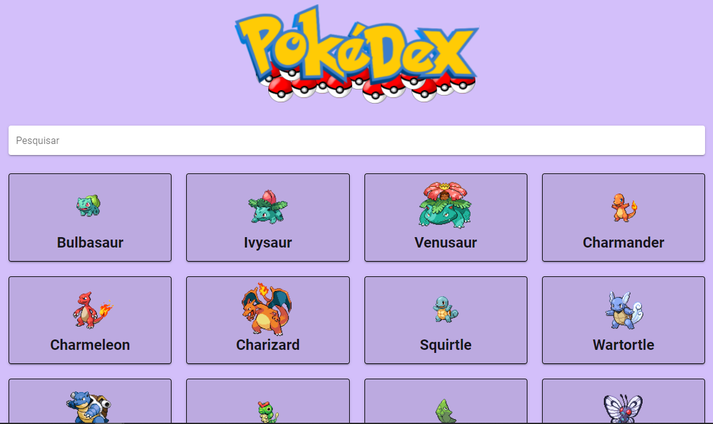
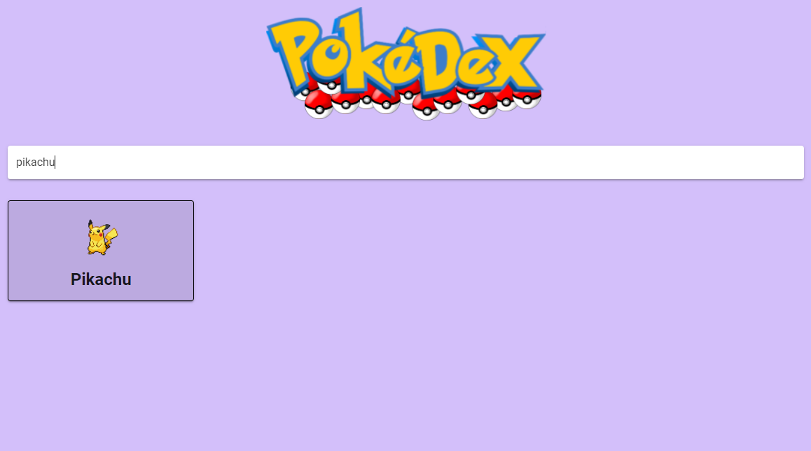
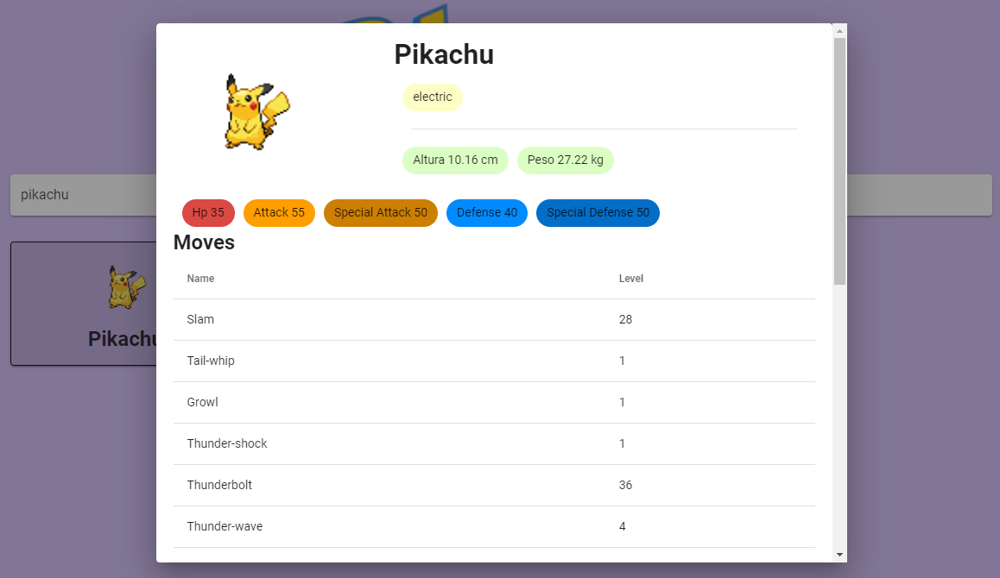

## Deploy: https://desafiofrontpoke.vercel.app/




## Project setup
```
npm install
```

### Compiles and hot-reloads for development
```
npm run serve
```

### Compiles and minifies for production
```
npm run build
```

### Lints and fixes files
```
### npm run serve

> pokedex@0.1.0 serve
> vue-cli-service serve

 INFO  Starting development server...


 DONE  Compiled successfully in 28775ms                                                                         16:27:13

dev _ Cleverton Rocha

  App running at:
  - Local:   http://localhost:8080/
  - Network: http://_ip 

  Note that the development build is not optimized.
  To create a production build, run npm run build.


### Customize configuration
See [Configuration Reference](https://cli.vuejs.org/config/).
